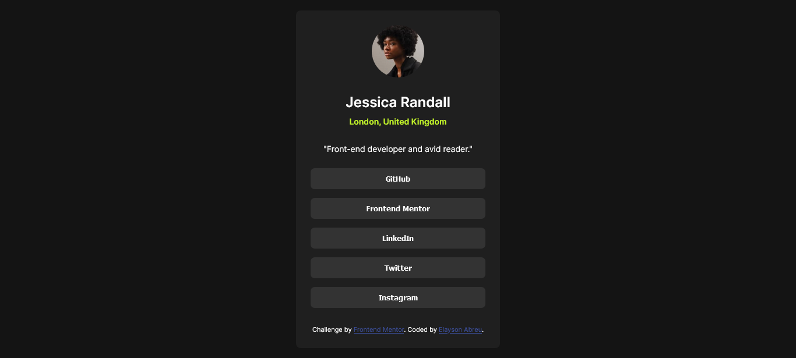

# Frontend Mentor - Social links profile solution

This is a solution to the [Social links profile challenge on Frontend Mentor](https://www.frontendmentor.io/challenges/social-links-profile-UG32l9m6dQ). Frontend Mentor challenges help you improve your coding skills by building realistic projects. 

## Table of contents

- [Overview](#overview)
  - [The challenge](#the-challenge)
  - [Screenshot](#screenshot)
  - [Links](#links)
- [My process](#my-process)
  - [Built with](#built-with)
  - [What I learned](#what-i-learned)
  - [Continued development](#continued-development)
  - [Useful resources](#useful-resources)
- [Author](#author)

## Overview

### The challenge

Users should be able to:

- See hover and focus states for all interactive elements on the page

### Screenshot



### Links

- Live Site URL: [Social Links Profile](https://elaysonabreu.github.io/frontendmentor-social-links-profile/)

## My process

### Built with

- Semantic HTML5 markup
- CSS custom properties
- Flexbox
- Mobile and desktop workflow

### What I learned

It is possible to give hoverability to `<button>` using the `:hover` pseudo-class, for example:

```css
button:hover {
  background-color: blue;
  color: green;
}
```

### Continued development

I want to learn more about other values ​​for `display` property, especially CSS Flexboxes.

### Useful resources

- [W3Schools](https://www.w3schools.com/csS/css3_buttons.asp) - It was essential to understand how `<button>` works.
- [W3Schools](https://www.w3schools.com/csS/css_align.asp) - Foi difícil centralizar `<body>` horizontal e verticalmente simultaneamente.

## Author

- Frontend Mentor - [@ElaysonAbreu](https://www.frontendmentor.io/profile/elaysonabreu)
